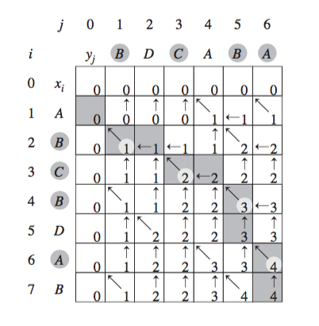
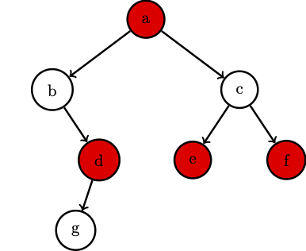

# Dynamic programming
These notes sketch dynamic programming lectures. Dynamic programming is treated in any introductory book on Algorithms. You may refer to Chapter 15 of *Introduction to Algorithms, 3rd Edition* by Thomas H. Cormen, Charles E. Leiserson, Ronald L. Rivest, Clifford Stein, The MIT Press, 2009 for a more detailed explanation and Chapter 6 of *Algorithms* by
S. Dasgupta, C.H. Papadimitriou, and U.V. Vazirani
[see here](https://people.eecs.berkeley.edu/~vazirani/algorithms/chap6.pdf).

These are rough and non-exhaustive notes that I used while lecturing. Please use them just to have a list of the topics of each lecture and use other reported references to study these arguments.

Feel free to send a pull request to fix any typo or to clarify any obscure description.


## Dynamic Programming: introduction
Dynamic programming, like the divide-and-conquer method, solves problems by combining the solutions to subproblems.

Divide-and-conquer algorithms partition the problem into disjoint subproblems, solve the subproblems recursively, and then combine their solutions to solve the original problem.

In contrast, dynamic programming applies when subproblems overlap, that is, when subproblems share subsubproblems.

In this context, a divide-and-conquer algorithm does more work than necessary, repeatedly solving the common subsubproblems.

A dynamic-programming algorithm solves each subsubproblem just once and then saves its answer in a table. Thus, avoiding the work of recomputing the answer every time it solves each subsubproblem.


## A first easy problem: Fibonacci numbers

Fibonacci numbers are defined as follows.

$F_0 = 0$

$F_1 = 1$

$F_n = F_{n-1}+ F_{n-2}$

Our goal is to compute the $n$th Fibonacci number $F_n$.

Consider the following trivial recursive algorithm.

```c++
uint64_t Fibonacci(uint64_t n) {
    if (n == 0) return 0;
    if (n == 1) return 1;
    else return Fibonacci(n-1) + Fibonacci(n-2);
}
```

The time complexity of this algorithm is given by the recurrence $T(n)=T(n-1)+T(n-2)+\Theta(1)$. It easy to see that $T(n)\geq F_n$.

$$T(n) > 2T(n-2) > 2(2T(n-4)) = 2^2T(n-4)$$
$$> 2^2(2T(n-6)) = 2^3T(n-6)> \ldots$$
$$> 2^k T(n-2k) > \ldots$$

Thus, for $n$ even, we get $T(n) > 2^\frac{n}{2}T(0)= 2^\frac{n}{2}c_0$ while
for $n$ odd, we get $T(n) > 2^\frac{n-1}{2}T(1)= 2^\frac{n-1}{2}c_1$.

Memoization is the trick that allows to reduce the time complexity. Whenver we
compute a Fibonacci number, we store it in a array $M$. Everytime we need a
Fibonacci number, we compute it only if the answer is not in the array.

```c++
uint64_t FibonacciMemo(n) {
    if (n == 0) return 0;
    if (n == 1) return 1;
    if (M[n] == NULL) M[n] = FibonacciMemo(n-1) + FibonacciMemo(n-2);
    return M[n];
}
```

This algorithm requires linear time and space.

Actually, there is a more direct bottom-up approach which uses linear time and constant space. How?

This approach typically depends on some natural notion of the "size" of a subproblem, such that solving any particular subproblem depends only on solving "smaller" subproblems.

We sort the subproblems by size and solve them in size order, smallest first. When solving a particular subproblem, we have already solved all of the smaller subproblems its solution depends upon, and we have saved their solutions.

We solve each sub-problem only once, and when we first see it, we have already solved all of its prerequisite subproblems.

In our Fibonacci problem this approach correspond to compute an array $F$
which entry $F[i]$ is the $i$th Fibonacci number.

We can fill this array from left (smaller subproblems) to right (larger
subproblems). Entry $F[i]$ requires only entries $F[i-1]$ and $F[i-2]$ only.

This way the solution is much more direct.

```c++
uint64_t FibonacciIterative(n) {
    vector<uint64_t> M(n);
    if (n == 0) return 0;
    if (n == 1) return 1;
    M[0] = 0;
    M[1] = 1;
    for(size_t i = 2; i < n; ++i)
        M[i] = M[i-1] + M[i-2];
    return M[n];
}
```

We note that there exist a faster algorithm to compute the $n$th Fibonacci number.
Indeed, the $n$th Fibonacci number is the top-left element of the 4x4 matrix

$$
M= \left(
    \begin{bmatrix}
    1 & 1 \\
    1 & 0
    \end{bmatrix}
\right)^n.
$$

The matrix can be computed in $\Theta(\log n)$ time by using [fast exponentiation](https://www.johndcook.com/blog/2008/12/10/fast-exponentiation/).

## Rod cutting

### Problem
*Serling Enterprises buys long steel rods and cuts them into shorter rods, which it then sells.
Each cut is free. The management of Serling Enterprises wants to know the best way to cut up the rods.
Given a rod of length $n$ and for any $i\in[1,n]$, the price $p_i$ of a rod
of length $i$, the goal is that of determining the maximum revenue $r_n$
obtainable by cutting up the rod and selling the pieces.*

The bottom-up DP solution of the problem is as follows.
Our goal is to fill an array $r[0, n]$, where entry $r[i]$ stores
the maximum revenue obtainable with a rod of size $i$.

Assuming we have already solved all the subproblems of size $j<i$,
what's the value of $r[i]$?

Let's list all the possibilities. We do not cut. The revenue is $p_i$ (or, if you prefer, $p_i + r[0]$).
We make a cut of length $1$ and we optimally cut the remaining rod of size $i-1$. The revenue in this case is $p_1 + r[i-1]$. We make a cut of length $2$ and we optimally cut the remaining rod of size $i-2$. The revenue is  $p_2 + r[i-2]$. And so on.

Clearly, the value of $r[i]$ is the maximum among all these revenues.

A possible implementation of this algorithm is reported below.

```c++
uint64_t RodCutting(uint64_t n, vector<uint64_t> &p) {
    vector<uint64_t> r(n+1, 0);
    for(size_t j = 1; j < n; ++j) {
        uint64_t q = 0;
        for(size_t i = 1; i < j; ++i)
            q = max(q, p[i] + r[j-i]);
        r[j] = q;
    }
    return r[n];
}
```

The algorithm runs in $\Theta(n^2)$ time.

The algorithm computes only optimal revenue but not a cut that gives such a revenue.
The algorithm can be easily modified to obtain a optimal cut. How?

Consider the following running example.

| length  | 0 | 1 | 2 | 3 | 4  | 5  | 6  | 7  | 8  | 9  | 10 |
|:---------|---:|---:|---:|---:|----:|----:|----:|---:|---:|---:|---:|
| price   | 0 | 1 | 5 | 8 | 9  | 10 | 17 | 17 | 20 | 24 | 30 |
| revenue | 0 | 1 | 5 | 8 | 10 | 13 | 17 | 18 | 22 | 25 | 30 |
| cut     | 0 | 1 | 2 | 3 | 2  | 2  | 6  | 1  | 2  | 3  | 10 |

## Minimum Cost Path
### Problem
*We are given a matrix $M$ of $n\times m$ integers. The goal is to find the minimum cost path to move from the top-left corner to the bottom-right corner by moving only down or to right.*

You can submit your solution [here](https://practice.geeksforgeeks.org/problems/path-in-matrix/0).

Consider the matrix below.

|||||
|---|---|---|---|
| 1 | 2 | 6 | 9 |
| 0 | 0 | 3 | 1 |
| 1 | 7 | 7 | 2 |

It is easy to see that the following recurrence solves the problem.

\[W(i,j) =   M[i,j] + \left\{
\begin{array}{ll}
      0 & \text{if } i = j = 1\\
      W(i,j-1) & \text{if } i = 1 \text{ and } j > 1\\
      W(i-1,j) & \text{if } i > 1 \text{ and } j = 1\\
      \min(W(i-1,j), W(i, j-1))& \text{otherwise}\\
\end{array}
\right. \]

Thus, the problem is solved in linear time by filling a matrix $W$.
Matrix $W$ for the example above is as follows.

|||||
|---|---|---|---|
| 1 | 3 | 9  | 18 |
| 1 | 1 | 4  | 5  |
| 2 | 8 | 11 | 7  |

## Longest Common Subsequence (LCS)
### Problem
*Given two sequences $S_1[1,n]$ and $S_2[1,m]$, find the length of longest subsequence present in both of them.*

You can submit your solution [here](https://practice.geeksforgeeks.org/problems/longest-common-subsequence/0).

As an example, consider $S_1 = ABCBDAB$ and $S_2 = BDCABA$.
A longest common subsequence is $BCBA$. There may be several other optimal solutions, e.g., $BCAB$.

The subproblems here ask to compute the LCS of prefixes of the two sequences: given two prefixes $S_1[1,i]$ and $S_2[1,j]$, our goal is to compute
${\sf LCS}(S_1[1,i], S_2[1,j])$.

Assume we already know ${\sf LCS}(S_1[1,i-1], S_2[1,j-1])$,
${\sf LCS}((S_1[1,i], S_2[1,j-1]))$, and  ${\sf LCS}(S_1[1,i-1], S_2[1,j])$,
i.e., three smaller subproblems.

If $S_1[i] = S_2[j]$, we can extend a LCS of $S_1[1,i-1]$ and $S_2[1,j-1]$
by adding the character $c=S_1[i]$. For example, $ABCB$ and $BDCAB$.
The LCS of $S_1[1,i-1] = $ABC$$ and $S_2[1,j-1] = $BDCA$$ has length $2$
and can be extended with character $c = B$.

Observe that we could also use ${\sf LCS}(S_1[1,i], S_2[1,j-1])$, and
${\sf LCS}(S_1[1,i-1], S_2[1,j])$ ignoring the match on the last character,
but these two cannot be longer.

Instead, if $S_1[i] \neq S_2[j] $, we can only consider
${\sf LCS}(S_1[1,i], S_2[1,j-1])$, and
${\sf LCS}(S_1[1,i-1], S_2[1,j])$.
We take the longest one.

Summarising,

\[{\sf LCS}(S_1[1,i], S_2[1,j]) =   \left\{
\begin{array}{ll}
      0 & i = 0 \text{ or } j = 0 \\
      {\sf LCS}(S_1[1,i-1], S_2[1,j-1]) + 1 & S_1[i]=S_2[j] \\
      \max({\sf LCS}(S_1[1,i], S_2[1,j-1]),
      {\sf LCS}(S_1[1,i-1], S_2[1,j])) & \text{otherwise}\\
\end{array}
\right. \]

Below the pseudocode of this algorithm where we use a matrix $C$ to store the solution of all the subproblems.

```
function LCSLength(X[1..m], Y[1..n])
    C = array(0..m, 0..n)
    for i := 0..m
       C[i,0] = 0
    for j := 0..n
       C[0,j] = 0
    for i := 1..m
        for j := 1..n
            if X[i] = Y[j]
                C[i,j] := C[i-1,j-1] + 1
            else
                C[i,j] := max(C[i,j-1], C[i-1,j])
    return C[m,n]
```

This algorithm runs in $\Theta(nm)$ time.

Figure below show the execution of the algorithm on $S_1 = ABCBDAB$ and
$S_2 = BDCABA$.



Take a look to [this](https://en.wikipedia.org/wiki/Longest_common_subsequence_problem) Wikipedia entry for more details.

## IWGBS - 0110SS
### Problem
*Dor is IWGolymp student so he has to count in how many ways he can make binary strings of length $N$ where zeroes cannot be next to each other. Help to him in how many different numbers can he make.*

You can submit your solution [here](https://www.spoj.com/problems/IWGBS/).

As an example, if $N = 3$, we have the following $5$ binary strings $101$, $010$, $111$, $110$, and $011$.

Let $F(N)$ be number we are looking for. We know that $F(1)=2$ and $F(0)=1$.
Any number with the desired property can be obtained either: 1) by taking any $n-1$ digits number and by appending a $1$, or by taking any $n-2$ number and by
appending $10$. Thus, $F(n)= F(n-1) + F(n-2)$ (Looks familiar?).

This problem is similar to the problem of completely covering a 2xn rectangle with 2x1 dominoes. See chapter 7.1 of *Concrete Mathematics, 2Ed.* by D. Knuth, O. Patashnik, and R. Graham.


## 0/1 Knapsack
### Problem
*We are given $n$ items. Each item $i$ has a value $v_i$ and a weight $w_i$.
We need put a subset of these items in a knapsack of capacity $C$ to get the maximum total value in the knapsack.*

You can submit your solution [here](https://www.spoj.com/problems/KNAPSACK/).

The problem is called 0/1 because each item is either selected or not selected.
Two possible variants of the problem allows to select fraction of the items (fractional knapsack problem) or select the same item multiple times (0/$\infty$ knapsack problem).

The problem is a well-know NP-Hard problem, which admits a pseudo-polynomial time algorithm.

We can use the following solutions.
- If $C$ is small, we can use *Weight Dynamic Programming*. The time
  complexity is $\Theta(Cn))$.
- Ff $V=\sum_i v_i$ is small, we can use *Price Dynamic Programming*. The time complexity is $\Theta(Vn))$.
- If both are large, we can use *branch and bound*. This approach is not covered by our lecture note.

The idea of the *Weight DP* algorithm is to fill a $(n+1)\times (C+1)$ matrix $K$.
Let $K[i, A]$ be the max profit for weight at most $A$ using items from $1$ up
to $i$. Thus, we have that $K[i, A] = \max(K[i-1, A], K[i-1, A-w[i]] +
v[i])$. The last entry $K[C,n]$ contains the solution.
We can fill the matrix $K$ in $\Theta(Cn))$ time.

Here an example. Consider a knapsack of capacity $C = 7$ and the following items.

| weight | value |
|--------:|-------:|
| 1      | 1     |
| 3      | 4     |
| 4      | 5     |
| 5      | 7     |

The matrix $K$ is as follows.

| value | weight | 0 | 1 | 2 | 3 | 4 | 5 | 6 | 7 |
|-------:|--------:|---:|---:|---:|---:|---:|---:|---:|---:|
| 1     | 1      | 0 | 1 | 1 | 1 | 1 | 1 | 1 | 1 |
| 4     | 3      | 0 | 1 | 1 | 4 | 5 | 5 | 5 | 5 |
| 5     | 4      | 0 | 1 | 1 | 4 | 5 | 6 | 6 | 9 |
| 7     | 5      | 0 | 1 | 1 | 4 | 5 | 7 | 8 | 9 |

The idea of the *Profit DP* algorithm is similar. We use a $(n+1)\times (V+1)$
matrix $K$. Let $K[V,i]$ be the min weight for profit at least $V$ using items
$1, \leq , i$. Thus, we have $K[A, i] = \min(K[A, i-1], K[A-p[i], i-1] +
w[i])$. The solution is $\max \{ a : K[A,n] \leq C \}$.

[Here](https://en.wikipedia.org/wiki/Knapsack_problem) you can find more details about this problem.

## Subset sum
### Problem
*Given a set $S$ of $n$ non-negative integers, and a value $v$, determine if there is a subset of the given set with sum equal to given $v$.*

You can submit your solution [here](https://practice.geeksforgeeks.org/problems/subset-sum-problem/0).

The problem is a well-know NP-Hard problem, which admits a pseudo-polynomial time algorithm.

The problem has a solution which is almost the same as 0/1 knapsack problem.

As in the 0/1 knapsack problem, we construct a matrix $W$ with $n+1$ rows and
$v+1$ columns. Here the matrix contains booleans.

Entry $W[i][j]$ is *True* if and only if there exists a subset of the first $i$ items with sum $j$, *False* otherwise.

The entries of the first row $W[0][]$ are set to false while entries of the first column $W[][0]$ are set to true.

Entry $W[i][j]$ is true either if $W[i-1][j]$ is true or $W[i-1][j-S[i]]$ is
true.

As an example, consider the set $S= \{3,2,5,1\}$ and value $v=6$. Below the matrix $W$ for this example.

| Elements \ v   | 0 | 1 | 2 | 3 | 4 | 5 | 6 |
|--------------|---|---|---|---|---|---|---|
| $\\emptyset$ | T | F | F | F | F | F | F |
| 3            | T | F | F | T | F | F | F |
| 2            | T | F | T | T | F | T | F |
| 5            | T | F | T | T | F | T | F |
| 1            | T | T | T | T | T | T | T |

The algorithm runs in $\Theta(vn)$ time.

[Here](https://en.wikipedia.org/wiki/Subset_sum_problem) you can find more details about this problem.

## Coin change
### Problem
*We have $n$ types of coins available in infinite quantities where the value of
each coin is given in the array $C=[c_1, c_2, \ldots, c_n]$.
The goal is find out how many ways we can make the change of the amount $K$ using the coins given.*

You can submit your solution [here](https://practice.geeksforgeeks.org/problems/coin-change/0).

For example, if $C=[1, 2, 3, 8]$, there are $3$ ways to make $K=3$, i.e., $1,1,1$,
$1,2$ and $3$.

The solution is similar to the one for 0/1 knapsack and subset sum problems.

The goal is to build a $(n+1)\times(K+1)$ matrix $W$, i.e., we compute the number of ways to change any amount smaller than or equal to $K$ by using coins in any prefix of $C$.

The easy cases are when $K=0$. We have just one way to change this amount.
Thus, the first column of $W$ contains $1$ but $W[0,0]=0$ which is the number of ways to change $0$ with no coin.

Now, for every coin we have an option to include it in the solution or exclude it.

If we decide to include the $i$th coin, we reduce the amount by coin value and
use the subproblem solution ($K-c[i]$).

If we decide to exclude the $i$th coin, the solution for the same amount
with­out considering that coin is on the entry above.

## Longest increasing subsequence (LIS)

### Problem
*Given a sequence $S$ of $n$ numbers, find the length of its longest increasing subsequence.*

You can submit your solution [here](https://practice.geeksforgeeks.org/problems/longest-increasing-subsequence/0).


As an example consider the sequence $S = 10, 22, 9, 21, 33, 50, 41, 60, 80$.
The length of LIS is $6$ and $10, 22, 33, 50, 60, 80$ is a LIS. In general, LIS is not unique, e.g., $9, 21, 33, 50, 60, 80$ is another LIS.


Consider the sequence $S[1,n]$ and let ${\sf LIS}(i)$ be the LIS of the prefix
$S[1,i]$ whose last element is $S[i]$.


\[{\sf LIS}(i) =   \left\{
\begin{array}{ll}
      1 + \max({\sf LIS}(j) \mid  1 \leq j < i \; \sf {and}\; S[j] < S[i])& \\
      1 & \text{if such } j \text{ does not exist}\\
\end{array}
\right. \]


It should be clear that the above recurrence can be solved in $\Theta(n^2)$ time.

[Here](https://en.wikipedia.org/wiki/Longest_increasing_subsequence) you can find more details about this problem.

### Dynamic programming as shortest/longest path on a DAG
Often it is convenient to reduce a problem to a (single source) longest path
computation on a suitable DAG.

Let's consider again the LIS problem. Our DAG $G$ has a vertex for each element of the sequence, plus a dummy vertex that marks the end of the sequence. Let us
use $v_i$ to denote the vertex corresponding to element $S[i]$, $v_{n+1}$
denotes the dummy vertex.

Edges are as follows. Every vertex has an edge to $v_{n+1}$. Moreover,
a vertex $v_j$ is connected to $v_i$ iff $j<i$ and $S[j]<S[i]$.
Thus, we have an edge $(v_j,v_i)$ iff $S[i]$ can follow $S[j]$ in a increasing
subsequence.

By construction, it should be clear that there exists a one-to-one
correspondence between increasing subsequences of $S$ and paths from $v_1$ to
$v_{n+1}$ on $G$. Thus, any longest path on $G$ corresponds to a LIS on $S$.

A longest path on a DAG $G$, even weighted ones, can be computed in time proportional to the number of edges in $G$.
The DAG above has at most $n^2$ edges and, thus, the reduction gives an algorithm with the same time complexity of the previous solution.

This reduction is always possible and sometimes it helps in reasoning about properties of the problems to get faster solutions.

### Speeding up LIS
Take a look to the tutorial here \url{http://www.geeksforgeeks.org/longest-monotonically-increasing-subsequence-size-n-log-n/} for a $\Theta(n\log n)$ time algorithm.

Intuition. For any position $i$ in $S$, consider the tuple $\langle i, {\sf LIS}(i), S[i]\rangle$.

We say that position $i$ *dominates* position $j$ iff ${\sf LIS}(i) \geq {\sf LIS}(j)$ and $S[i]<S[j]$.

Considering only dominant positions suffices to find a LIS.

Given a new position $k$, what's the length of the LIS of the subsequence up to $k$ which ends at position $k$?

We search for dominant position $i$ such that $S[i]$ is the predecessor of $S[k]$. Then, ${\sf LIS}(k) = 1 + {\sf LIS}(i)$.

We can use a BST to store dominant positions.

### Erdős–Szekeres theorem, 1935
*For any $r$ and $s$, any sequence $A$ of distinct real numbers with length $n$ at least $(r − 1)(s − 1) + 1$
contains a monotonically increasing subsequence of length $r$ or a monotonically decreasing subsequence of length $s$.*

See [here](https://en.wikipedia.org/wiki/Erd%C5%91s%E2%80%93Szekeres_theorem) for more details.

A proof uses longest increasing subsequence (LIS) and longest decreasing subsequence (LDS) tables built with dynamic programming.

Consider the LIS and LDS tables computed with DP.
For an element of $A$ in position $i$ we have the pair $\langle LIS[i], LDS[i] \rangle$.
The claim is that there are no equal pairs.

Consider two positions $i$ and $j$ with $i < j$. There are two cases.

- if A[i] < A[j], then $LIS[j] \geq LIS[i] + 1$;
- if A[i] > A[j], then $LDS[i] \geq LDS[j] + 1$.

As all the pairs are distinct, by Pigeonhole principle, there must be a pair with either a LIS value larger than $r-1$ or a LDS value larger than $s-1$.

## Longest Bitonic Subsequence
### Problem
*Given a sequence $S[1,n]$, find the length of its longest bitonic
subsequence. A bitonic sequence is a sequence that first increases and then decreases.*

You can submit your solution [here](https://practice.geeksforgeeks.org/problems/longest-bitonic-subsequence/0).

Consider for example the sequence $S= 2, -1, 4, 3, 5, -1, 3, 2$.
The subsequence $-1, 4, 3, -1$ is bitonic. A longest bitonic subsequence is $ 2,3,5,3,2$.

The idea is to compute the longest increasing subsequence from left to right and the longest increasing subsequence from right to left by using the $\Theta(n\log n)$ time solution of the previous lecture.

Then, we combine these two solutions to find the longest bitonic subsequence.
This is done by taking the values in a column, adding them and subtracting one.
This is correct because ${\sf LIS}[i]$ computes the longest increasing subsequence of $S[1,i]$ and ends with $S[i]$.

| S            | 2 | -1 | 4 | 3 | 5 | -1 | 3 | 2 |
|--------------|---|-----|---|---|---|-----|---|---|
| LIS | 1 | 1   | 2 | 2 | 3 | 1   | 2 | 2 |
| LDS | 2 | 1   | 3 | 2 | 3 | 1   | 2 | 1 |
| LBS | 2 | 1   | 4 | 3 | 5 | 1   | 3 | 2 |

## Minimum number of jumps
### Problem
*Given an array of integers where each element represents the max number of steps that can be made forward from that element. Write a function to return the minimum number of jumps to reach the end of the array (starting from the first element). If an element is $0$, then cannot move through that element.*

You can submit your solution [here](https://practice.geeksforgeeks.org/problems/minimum-number-of-jumps/0).

As an example, consider the array $1, 3, 5, 8, 9, 2, 6, 7, 6, 8, 9$.
The minimum number of jumps is $3$, i.e., $1, 3, 9$.

Think about the reduction to a SSSP on a DAG. This gives a $\Theta(n^2)$ time
solution.

A linear time solution is [here](http://www.geeksforgeeks.org/minimum-number-jumps-reach-endset-2on-solution/).

## Largest independent set on trees
### Problem
*Given a tree $T$ with $n$ nodes, find one of its largest independent sets.*

An independent set is a set of nodes $I$ such that there is no edge connecting any pair of nodes in $I$.

Example below shows a tree whose largest independent set consists of the red nodes a, d, e, and f.



In general the largest independent set is not unique. For example, we can obtain a different largest independent set by replacing nodes a and d with nodes b and g.

Consider a bottom up traversal of the tree $T$. For any node $u$, we have two possibilities: either add or not add the node $u$ to the independent set.

In the former case, $u$'s children cannot be part of the independent set but its grandchildren could.
In the latter case, $u$'s children could be part of the independent set.

Let ${\sf LIST}(u)$ be the size of the independent set of the subtree rooted at $u$ and let $C_u$ and $G_u$ be the set of children and the set of grandchildren of $u$, respectively.

Thus, we have the following recurrence.
\[{\sf LIST}(u) =   \left\{
\begin{array}{ll}
      1 & \text{if } u \text{ is a leaf}\\
      \max(1 + \sum_{v \in G_u}{\sf LIST}(v),  \sum_{v \in C_u}{\sf LIST}(v))& \text{otherwise}\\
\end{array}
\right. \]

The problem is, thus, solved with a post-order visit of $T$ in linear time.

Observe that the same problem on general graphs is NP-Hard.

## Edit distance
### Problem
*Given two strings $S_1[1,n]$ and $S_2[1,m]$, find the minimum number of edit operations required to transform $S_1$ into $S_2$.*
*There are three edit operations:*
- *Insert a symbol at a given position*
- *Replace a symbol at a given position*
- *Delete a symbol at a given position.*

You can submit your solution [here](https://practice.geeksforgeeks.org/problems/edit-distance/0).

For example, if the two strings are $S_1 = hello$ and $S_2 = hallo$,
the edit distance is $1$ as we can replace symbol $e$ with $a$ in second positions of $S_1$.

Let ${\sf ED}(i,j)$ be the edit distance of prefixes $S_1[1,i]$ and $S_2[1,j]$.
The idea is to compute ${\sf ED}(i,j)$ by using shorter prefixes as subproblems.
Indeed, we can compute ${\sf ED}(i,j)$ with the following recurrence.

\[{\sf ED}(i,j) =   \left\{
\begin{array}{ll}
     i & \text{if } $j = 0$\\
     j & \text{if } $i = 0$\\
     {\sf ED}(i-1,j-1) & \text{if } $S[i] = S[j]$ \\
     1 + \min({\sf ED}(i,j-1), {\sf ED}(i-1,j), {\sf ED}(i-1,j-1)) & \text{otherwise}\\
\end{array}
\right. \]

Here we report the matrix obtained for the strings $S_1 = agced$ and $S_2 = abcdef$.

|   | ∅ | a | b | c | d | e | f |
|---|---|---|---|---|---|---|---|
| ∅ | 0 | 1 | 2 | 3 | 4 | 5 | 6 |
| a | 1 | 0 | 1 | 2 | 3 | 4 | 5 |
| g | 2 | 1 | 1 | 2 | 3 | 4 | 5 |
| c | 3 | 2 | 2 | 1 | 2 | 3 | 4 |
| e | 4 | 3 | 3 | 2 | 2 | 2 | 3 |
| d | 5 | 4 | 4 | 3 | 2 | 3 | 3 |

[Here](https://en.wikipedia.org/wiki/Edit_distance) you can find more details about this problem.

## Longest palindromic subsequence
### Problem
*Given a sequence $S[1,n]$, find the length of its longest palindromic subsequence.*

You can submit your solution [here](https://practice.geeksforgeeks.org/problems/longest-palindromic-subsequence/0).

Given sequence is $S=bbabcbcab$, then the output should be $7$ as $babcbab$ is the longest palindromic subsequence in it. Notice that $bbbbb$ and $bbcbb$ are palindromic subsequences of $S$, but not the longest ones.

Let ${\sf LPS}(i,j)$ be the length of the longest palindromic subsequence of
$S[i,j]$.

There is a very easy solution which reduces to the Longest Common Subsequence Problem.
Indeed, it is easy to see that the longest common subsequence of $S$ and $S^R$, i.e.,
$S$ reversed, is the longest palindromic subsequence in $S$.

A direct computation of the longest palindromic subsequence is based on the idea
of computing ${\sf LPS}(i,j)$ by using three subproblems.
If $S[i]$ and $S[j]$ equal, then we can extend the longest palindromic subsequence of $S[i+1, j-1]$ by prepending and appending character $S[i]$.
If this is not the case, then the longest palindromic subsequence is
the longest palindromic subsequence of either $S[i+1, j]$ or $S[i, j-1]$.

Thus, the recurrence is as follows.

\[{\sf LPS}(i,j) =   \left\{
\begin{array}{ll}
     0 & \text{if } $i > j$\\
      1 & \text{if } $i = j$\\
      2 + {\sf LPS}(i+1,j-1) & \text{if } $S[i] = S[j]$\\
      \max({\sf LPS}(i+1,j),  {\sf LPS}(i,j-1))& \text{otherwise}\\
\end{array}
\right. \]

Here we report the matrix obtained for the example above. Observe that we have to fill the matrix starting from its diagonal

|   | b | b | a | b | c | b | c | a | b |
|---|---|---|---|---|---|---|---|---|---|
| b | 1 | 2 | 2 | 3 | 3 | 5 | 5 | 5 | 7 |
| b | 0 | 1 | 1 | 3 | 3 | 3 | 3 | 5 | 7 |
| a | 0 | 0 | 1 | 1 | 1 | 3 | 3 | 5 | 5 |
| b | 0 | 0 | 0 | 1 | 1 | 3 | 3 | 3 | 5 |
| c | 0 | 0 | 0 | 0 | 1 | 1 | 3 | 3 | 3 |
| b | 0 | 0 | 0 | 0 | 0 | 1 | 1 | 1 | 3 |
| c | 0 | 0 | 0 | 0 | 0 | 0 | 1 | 1 | 1 |
| a | 0 | 0 | 0 | 0 | 0 | 0 | 0 | 1 | 1 |
| b | 0 | 0 | 0 | 0 | 0 | 0 | 0 | 0 | 1 |


## Weighted job scheduling
### Problem
*There are $n$ jobs and three arrays $S[1\ldots n]$ and $F[1\ldots n]$ listing
the start and finish times of each job, and $P[1\ldots n]$ reporting the
profit of completing each job.
The task is to choose a subset $X \subseteq \{1, 2, \ldots, n\}$
so that for any pair $i,j \in X$, either $S[i] > F[j]$ or
$S[j] > F[i]$, which maximizes the total profit.*

Consider the following example. Arrays are $S=[1,2,4,6,5,7]$, $F=[3,5,6,7,8,9]$,
and $P=[5,6,5,4,11,2]$.

The solution is as follows. We first sort the jobs by finish time.

Let ${\sf WJS}(i)$ be the maximum profit by selecting among the first $i$ jobs
(ordered by finish time).

The value of ${\sf WJS}(i)$ is computed by either excluding or including $i$th
job. If we exclude $i$th job, then ${\sf WJS}(i)={\sf WJS}(i-1)$.
Instead, if it is included, then we have to find the largest index of $j$ such
that $F[j] \leq S[i]$ so that ${\sf WJS}(i)={\sf WJS}(j) + P[i]$.
Obviously, among these two possibilities, we take the one that give the largest profit.

We assume we have a fake job with index $0$ whose finish time is $-\infty$.
We also let ${\sf WJS}(0)$ to be $0$. This serves as sentinel to avoid special
cases.

Observe that sorting by finish time guarantees that if we current job $i$ does
not overlap with $j$th job, then it does not overlap with any other job with a
smaller index. This means that we can safely use the value ${\sf WJS}(j)$.

Notice that the index $j$ can be found in $\Theta(\log n)$ time with binary
search. Thus, the algorithm runs in $\Theta(n\log n)$ time.

| S | -           | 1 | 2 | 4  | 6  | 5  | 7  |
|---|-------------|---|---|----|----|----|----|
| F | $\infty$    | 3 | 5 | 6  | 7  | 8  | 9  |
| P | 0           | 5 | 6 | 5  | 4  | 11 | 2  |
| R | 0           | 5 | 6 | 10 | 14 | 17 | 17 |


We notice that this problem under the hypothesis that all the jobs have the same profit is called *activity selection*. For that easier problem, a greedy algorithm finds the optimal schedule in $\Theta(n\log n)$ time.

## A coin problem
*A coin is tossed $n$ times. Find the number of combinations such that there is no $3$ consecutive tails.*

You can submit your solution [here](https://www.hackerearth.com/challenges/college/lets-code-20/algorithm/coin-problem-2/).

We use a $n\times 3$ matrix $dp$.  
For each position $i$, we would like to compute

- $dp[i][0]$ is the number of combinations for $i$ tosses that ends with head
- $dp[i][1]$ is the number of combinations for $i$ tosses that ends with a tail preceded by head
- $dp[i][2]$ is the number of combinations for $i$ tosses that ends with two tails preceded by head.

The result is $dp[n][0]+dp[n][1]+dp[n][2]$.

How do we compute $dp[i][0]$?

We have
- $dp[1][0] = 1$
- $dp[1][1] = 1$
- $dp[1][0] = 0$

For a generic position $i$, we compute the three corresponding columns as follows.

- We put a head in position $i$. In this case we have $dp[i][0] = dp[i-1][0]+dp[i-1][1]+dp[i-1][2]$.
- We put a tail in position $i$. In this case we have $dp[i][1] = dp[i-1][0]$
and $dp[i][2] = dp[i-1][1]$.

## Two other coin problems
*There are two players: Alice and Bob. We have an even number $n$ of coins of different values in a row. First Alice picks up a coin from one of the ends.
Then, Bob takes a coins  from one of the (new) ends, and so on.
The game ends when Bob takes the last coin. Is there any stategy for Alice
which always guarantes Alice to get at least as much money as Bob?*

This puzzle is described in *Mathematical Puzzles* by Peter Winkler.

Consider coins at even positions and coins at odd positions.
As there is a even number of coins and Alice starts first,
she can always choose to get all coins at even positions or all coins at
odd positions. Thus, she simply chooses even or odd depending on which
gives the best result.

Notice that this strategy always works, no matter the values of the coins.
Moreover, there no possible strategy when the number of coins is odd.
For example, if we have three coins $1,3,1$ Bob always wins no matter Alice's strategy.

*We are playing the same game before. Given the $n$ coins $A[1,n]$, we want
to maximize the difference between coins taken by Alice and the ones of Bob.
We assume that both players play optimally.*

Let be $dp(i,j)$ be the best difference we can have on the subarray $A[i,j]$
when Alice is the first one to choose.

\[{\sf dp}(i,j) =   \left\{
\begin{array}{ll}
      0 & \text{if } $i > j$\\
      A[i] & \text{if } $i = j$\\
      \max(A[i] - {\sf dp}(i+1,j),  A[j] -{\sf dp}(i,j-1))& \text{otherwise}\\
\end{array}
\right. \]

Here is an example.

|  | 10 | 1 | 3  | 5  | 1  | 7  |
|---|----|---|----|----|----|----|
| i/j  | 1  | 2 | 3  | 4  | 5  | 6  |
| 1 | 10 | 10-1 = 9 | 10-2 = 8  | 10-3 = 7  | 10-2=10 | **10-5=5** |
| 2 | 0  | 1 | 3-1 = 2  | 5-2 = 3  | 1+1 = 2  | 7-2=5  |
| 3 | 0  | 0 | 3 | 5-3 = 2  | 3-4=-1 | 7+1 = 8  |
| 4 | 0  | 0 | 0 | 5 | 5-1 = 4  |  7-4 = 3 |
| 5 | 0  | 0 | 0 | 0 | 1 | 7-1 = 6  |
| 6 | 0  | 0 | 0 | 0 | 0 | 7 |


## Multiplicity
*You are given an integer array $a_1, a_2, \ldots, a_n$.
The array $b$ is called to be a subsequence of $a$ if it is possible to remove some elements from $a$ to get $b$.*

*Array $b_1, b_2, \ldots, b_k$. is called to be good if it is not empty and for
every $j$ ($1\leq j \leq k$) $b_j$ is divisible by $j$.*

*Find the number of good subsequences in $a$ modulo $10^9+7$.*

The value of $n$ is up to $10^5$, elements of $a$ are up to $10^6$.

You can submit your solution [here](https://codeforces.com/problemset/problem/1061/C)

We use $M[i][j]$ to count the number of good subsequences of $a[1,i]$ of
length $j$.

$M[i][j]$ is equal to $M[i-1][j] + [j|a_i]M[i-1][j-1]$, i.e., we add $M[i-1][j-1]$
only if $j$ divides $a_i$.

This solution would require $\Theta(n^2)$ time and space.

To reduce the space use, we notice that we do not need to use a 2D matrix but we can simply use a vector to store only the last column of $M$.

To reduce the time, we observe that we only need to update rows corresponding to indexes $j$ that divides the current element $a_i$. Observe that
$a_i$ as at most $\sqrt{a_i}$ divisors (only numbers from $1$ to $\sqrt{a_i}$).
Time complexity is thus $O(n\sqrt{n})$.

## Geometric progression
*We are given an array $A[1,n]$ and an integer $K$.
The goal is to count the number of subsequence of $A$ of length $3$ form a geometric progression with ratio $K$.
A geometric progression with ratio $K$ is $b, bK^0, bK^1, bK^2, \ldots$*

You can submit your solution [here](https://codeforces.com/problemset/problem/567/C)

For every entry $A[i]$ we want to know the numbers $N[i,1]$, $N[i,2]$ and $N[i,3]$ of subsequences of length, respectively, $1$, $2$, and $3$ in the prefix $A[1,i]$ which end with a number equal to $A[i]$. We keep a counter $c$.

These numbers can be computed as follows:
- $N[i,1] = N[j,1]+1$, where $j<i$ is the largest position such that $A[j]=A[i]$;
- $N[i,2] = N[j,2] + N[j',1]$, where $j$ is as before and $j'<i$ is the largest position such that $A[j]=A[i]/K$;
- $N[i,3] = N[j,3] + N[j',2]$, where $j$ and $j'$ are as before. $c += N[j',2]$.

Notice, that instead of computing positions $j$ and $j'$, we could use a map indexed by values in $A$.

This solution can be easily generalised to solve the same problem with longer subsequences.

An easier solution that works for length $3$ only is explained in the tutorial.
The idea is to let the current element $A[i]$ be in the middle of a subsequence and to count the number of occurrences of $A[i]/K$ to the left and the number of occurrences of $A[i]K$ to the right, and then multiplying these numbers.

## Further exercises
- [Tavel Card](https://codeforces.com/problemset/problem/756/B)
- [Coloring Trees](https://codeforces.com/problemset/problem/711/C)
- [Bob and K-subset](https://www.hackerearth.com/practice/basic-programming/implementation/basics-of-implementation/practice-problems/algorithm/bob-and-subset-23f0729c/)
- [Caesar's Legions](https://codeforces.com/contest/118/problem/D)

## Further readings

- A [list](https://codeforces.com/blog/entry/67679) of links to tutorials and problems.
- Dynamic Programming with Bitmasks: [tutorial](https://www.hackerearth.com/practice/algorithms/dynamic-programming/bit-masking/tutorial/).
